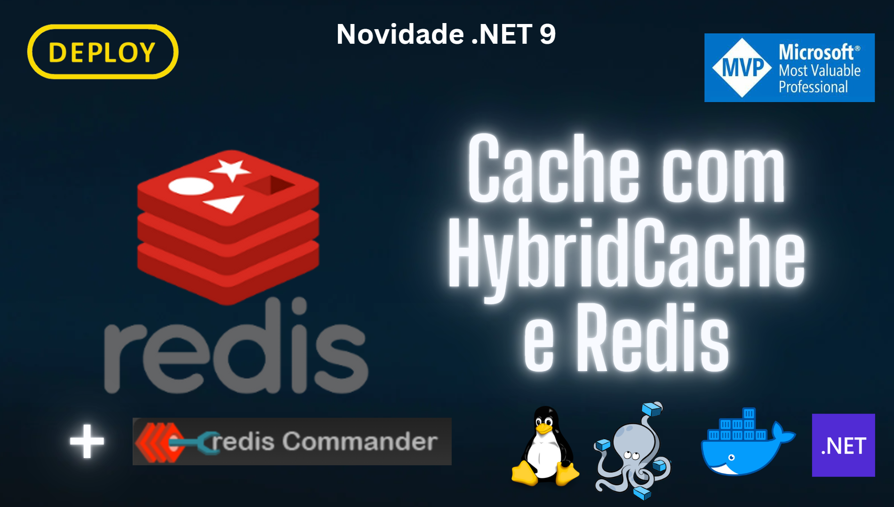

# HybridCache-Redis-v1

Apresentacao no canal DEPLOY em 26/11/2024



> [!NOTE]
> O conteúdo técnico deste repositório é baseado em documentações oficiais da Microsoft. O objetivo é compartilhar conhecimento com a comunidade técnica.

> [!TIP]
> :star2: Considere dar uma estrela para este repositório! :star2:

> [!IMPORTANT]
> Caso tenha alguma dúvida ou sugestão, por favor, abra uma issue.

> [!WARNING]
> Não utilize este repositório em produção.

> [!CAUTION]
> Não se esqueça de ler a documentação oficial da Microsoft.

## Documentação Oficial

```
https://learn.microsoft.com/en-us/aspnet/core/performance/caching/hybrid?view=aspnetcore-9.0
```

## Executar o Container

```
docker run --name redisDEPLOY -p 6379:6379 redis:7.4.1
```

```
docker exec -it redisDEPLOY redis-cli
```

## URL do Emulador

```
https://localhost:9081
```

## Calculadora

```
https://azure.microsoft.com/pt-br/pricing/calculator
```

# Comandos Redis

```
ping
```

## String --> https://redis.io/commands/append

```
set e setex
```

```
set <key> <value>
```

```
set <key> <value> EX 10s
```

```
get <key>
```

```
append <key> <value>
```

```
mset <key> <value> <key> <value> | set em varias chaves e seus valores
```

```
mget <key> <key> <key> ... | obtem os valores das chaves solicitadas
```

```
expire <key> <tempo>
```

```
ttl <key>
```

## saber o endereço de memoria

```
dump <key>
```

## namespace

```
set <key>:<id> <value>
```

## substring

```
getrange <key> <start> <stop>
```

#incrementar em caso da chave tiver um valor inteiro

```
incr <key>
```

# para incrementar um inteiro a partir de outro valor

```
incrby <key> <value>
```

## Listas --> https://redis.io/commands/rpush

#### (pilha e fila) ou lista

```
rpush <key> v1 v2 v3 | adiciona os valores a direita
```

```
lpush <key> v1 v2 v3 | adiciona os valores a esquerda
```

```
pop | retira da fila pelo indice
```

```
lrange <key> | tamnho da pilha
```

```
lpop <key>
```

```
rpop <key>
```

```
llen
```

## Hash --> https://redis.io/commands/hmset \* a mais utilizada

```
hset <key1> <field1> <value>
```

```
hset <key1> <field2> <value>
```

```
hkeys
```

```
hgetall <key>
```

```
hget Aplicacao-ClienteRedisRepository:1 data
```

```
hget Aplicacao-BasketRepository:123 data
```

======

# deletar uma chave

```
del <key>
```

# listar todas as chaves

```
keys *
```

# listar chaves que contem um caracter

```
keys *caracter* | * = infinito
```

# obter o tipo de uma chave

```
type <key>
```

# Mensageria

```
subscribe nomecanal
```

```
publish nomecanal aaaaaa

```

====
Os sets em Redis representam conjuntos de valores que não se repetem. Ao fazer uma adição de um elemento já existe em um set, o comando não faz nada com o set.

O comando de escrita em set é:

“SADD chave valor”: tenta adicionar o valor dado à chave dada.
A leitura pode ser feita com os comandos:

“SMEMBERS chave”: retorna todo o set.
“SISMEMBER chave valor”: retorna se o valor dado está ou não no set.
Ainda é possível remover um elemento com:

“SREM chave valor”: tenta remover o valor dado do set.
```
redis> SADD myset "Hello"
(integer) 1
redis> SADD myset "World"
(integer) 1
redis> SADD myset "World"
(integer) 0
redis> SMEMBERS myset
```
1. "World"
2. "Hello"
   redis>
   ====

# deletar todas as chaves

```

flushall

```
